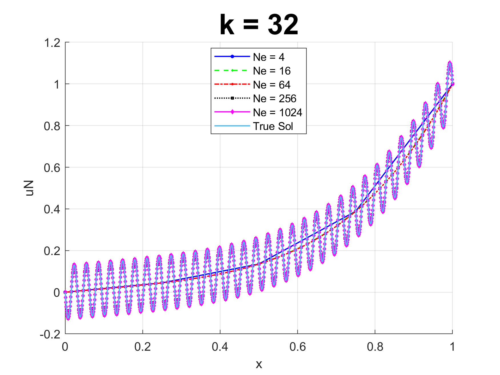

# matlab-fem-project

<div style="text-align: center;">
  
</div>

This repository contains a Finite Element Method (FEM) solver for structural mechanics simulations in both 1D and 2D. Developed as part of coursework for ME C180 at UC Berkeley.
It consists of various projects (1 so far) intended to tackle various FEM problems.

## Features
- 1D and 2D FEM simulations.
- Linear elastic material modeling.
- Supports a variety of element types (e.g., linear, cube, tri).
- Different boundary condition handling (Dirichlet, Neumann).

## Requirements
- MATLAB (Written in R2024b, but only versions likely work.)

## Projects
1. **1D Stick Problem**: Initial implementation solving a known 1D FEM problem and calculating the error.

## Usage
1. Clone the repository:
   ```git clone https://github.com/username/matlab-fem-project.git```
2. Open MATLAB and add project to your path.
   ```addpath(genpath('path/to/matlab-fem-project'))```
3. Run the script! (There are various different iterations of the project to choose from, each represents the addition of a new feature.
